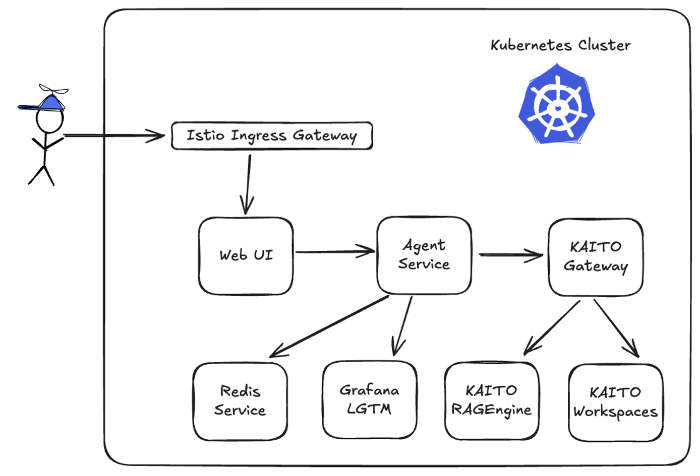

# Rage Against the Machine: Fighting AI Complexity With Kubernetes Simplicity

> Demo application for [KubeCon North America 2025 breakout session](https://kccncna2025.sched.com/event/2f0e74406851a0d1563e79e1759698e5)

An AI chat application demonstrating RAG pipelines with KAITO on Azure Kubernetes Service, featuring:

- **KAITO**: Simplified AI model management and serving with GPU support
- **RAGEngine**: Document retrieval and augmented generation for KubeCon schedule data
- **Next.js**: Retro arcade-themed chat UI
- **FastAPI**: Agent service with KAITO integration
- **Azure Cache for Redis**: Managed session storage
- **OpenTelemetry**: Distributed tracing and observability

This demo shows how KAITO simplifies building AI applications on Kubernetes by reducing infrastructure complexity, allowing developers to focus on application logic instead of managing vector DBs, embeddings, and indexing pipelines.

## 🏗️ Architecture



The application is deployed on Azure with:

- **Web Frontend**: Next.js application for user interaction
- **Agent Service**: FastAPI backend that communicates with OpenAI-compatible endpoints via Agent Framework SDK
- **Azure Kubernetes Service (AKS)**: Container orchestration with GPU node pools
- **KAITO Workspaces**: Managed AI model serving (GPT-OSS-20B, Phi-4-Mini-Instruct)
- **RAGEngine**: Managed retrieval-augmented generation service
- **Istio with Gateway API**: Ingress and Inference Extension for body-based model routing
- **Grfana LGTM**: Observability dashboard for tracing and metrics
- **Redis**: Session management for chat application

## 📋 Prerequisites

- Azure subscription with appropriate permissions and GPU quota
- Azure CLI
- kubectl
- Terraform
- Docker with Buildx

## 🚀 Deployment Guide

### Step 1: Provision Azure Resources

Navigate to the infrastructure directory and run Terraform:

```bash
cd infra/azure
export ARM_SUBSCRIPTION_ID=$(az account show --query id -o tsv)
terraform init
terraform apply -auto-approve
```

Save the output values for later use:

```bash
terraform output | sed 's/ = /=/g; s/"//g' > .env
source .env
```

Connect to your AKS cluster:

```bash
cd ../../
az aks get-credentials -g $rg_name -n $aks_name
```

Optional if you want to use TLS certificate for Istio Gateway:

```bash
kubectl create secret tls wildcard-tls --key=<your-wildcard-tls-key-file> --cert=<wildcard-tls-cert-file>
```

### Step 2: Build and Push Container Images

Connect to Azure Container Registry:

```bash
az acr login --name $acr_name
```

Build and push the agent image:

```bash
docker buildx build \
  --platform linux/amd64 \
  -t $acr_name.azurecr.io/agent:latest \
  -f src/agent/Dockerfile \
  src/agent \
  --push
```

Build and push the web image:

```bash
docker buildx build \
  --platform linux/amd64 \
  -t $acr_name.azurecr.io/web:latest \
  -f src/web/Dockerfile \
  src/web \
  --push
```

Build and push the schedule parser image:

```bash
docker buildx build \
  --platform linux/amd64 \
  -t $acr_name.azurecr.io/sched:latest \
  -f src/sched/Dockerfile \
  src/sched \
  --push
```

Configure Kustomize overlays with your container images:

```bash
# Set images for chat app
cd infra/k8s/overlays/kaito-chat-app && \
kustomize edit set image agent=${acr_name}.azurecr.io/agent:latest && \
kustomize edit set image web=${acr_name}.azurecr.io/web:latest && \
cd -

# Set image for schedule parser
cd infra/k8s/overlays/kaito-rag && \
kustomize edit set image sched=$acr_name.azurecr.io/sched:latest && \
cd -
```

### Step 3: Deploy KAITO and Kubernetes Resources

Install Gateway API CRDs for body-based routing ([docs](https://kaito-project.github.io/kaito/docs/gateway-api-inference-extension#1-install-istio-and-deploy-gateway)):

```bash
kubectl apply -k "github.com/kubernetes-sigs/gateway-api/config/crd?ref=v1.3.0"
```

Deploy base Kubernetes resources (Redis and LGTM observability stack):

```bash
kubectl apply -k infra/k8s/base
```

Deploy KAITO workspaces and Gateway API resources:

```bash
kubectl apply -k infra/k8s/overlays/kaito
```

Wait for KAITO workspaces to be fully ready:

```bash
kubectl wait --for=condition=ResourceReady workspace wks-gpt-oss-20b wks-phi-4-mini-instruct --timeout=10m
kubectl wait --for=condition=InferenceReady workspace wks-gpt-oss-20b wks-phi-4-mini-instruct --timeout=10m
kubectl wait --for=condition=WorkspaceSucceeded workspace wks-gpt-oss-20b wks-phi-4-mini-instruct --timeout=10m
```

### Step 4: Deploy Chat Application

Deploy the chat application:

```bash
kubectl apply -k infra/k8s/overlays/kaito-chat-app
```

Get the ingress IP and configure local DNS:

```bash
INGRESS_PUBLIC_IP=$(kubectl get svc kaito-gateway-istio -o jsonpath='{.status.loadBalancer.ingress[0].ip}')
echo "$INGRESS_PUBLIC_IP kaito.example.com" | sudo tee -a /etc/hosts
```

Open your browser and navigate to [http://kaito.example.com](http://kaito.example.com)

### Step 5: Enable RAG with KubeCon Schedule Data

Create a ConfigMap with KubeCon NA 2025 schedule data:

```bash
# Download and create ConfigMap from KubeCon schedule ICS file
kubectl create configmap calendar-data --from-file=all.ics=<(curl -s https://kccncna2025.sched.com/all.ics)
```

Deploy the RAG indexing workflow:

```bash
kubectl apply -k infra/k8s/overlays/kaito-ragcl
```

Wait for RAGEngine to be fully ready:

```bash
kubectl wait --for=condition=ResourceReady ragengine/rag-gpt-oss-20b --timeout=10m
kubectl wait --for=condition=ServiceReady ragengine/rag-gpt-oss-20b --timeout=10m
```

Run the indexing workflow:

```bash
argo submit --watch --from workflowtemplate/schedule-index-pipeline

# Optionally clean up succeeded pods
kubectl delete pod --field-selector=status.phase=Succeeded
```

Deploy the RAG-enabled chat application:

```bash
kubectl apply -k infra/k8s/overlays/kaito-rag-chat-app
```

Now your chat application can answer questions about the KubeCon schedule! 🚀

## 🧪 Demo Scenarios

### Demo 1: Workspace Model Querying

Port-forward to KAITO workspace services:

```bash
kubectl port-forward svc/wks-gpt-oss-20b 5000:80 &
kubectl port-forward svc/wks-phi-4-mini-instruct 5001:80 &
```

Use the [HTTP test client](./demo/1-wks.http) to query models directly.

### Demo 2: Workspace Model Querying with Gateway API Inference Extension

Test body-based routing with the Gateway API:

```bash
INGRESS_PUBLIC_IP=$(kubectl get svc kaito-gateway-istio -o jsonpath='{.status.loadBalancer.ingress[0].ip}')
echo $INGRESS_PUBLIC_IP
```

Use the [HTTP test client](./demo/2-gwaie.http) to test intelligent routing based on request body. Be sure to replace `<your-gateway-api-ip-or-domain>` with the actual IP or domain.

### Demo 3: RAG Engine Querying

Port-forward to RAGEngine:

```bash
kubectl port-forward svc/rag-gpt-oss-20b 5002:80 &
```

Use the [HTTP test client](./demo/3-rag.http) to query the RAG engine for schedule information.

## Demo 4: Full Chat Application

Open your browser and navigate to [http://kaito.example.com](http://kaito.example.com) to interact with the full chat application that leverages KAITO, RAGEngine, and the KubeCon schedule data.

## 🛠️ Local Development

For local development against the deployed AKS cluster, port-forward required services:

```bash
kubectl port-forward svc/otel-collector 4317:4317 &
kubectl port-forward svc/redis 6379:6379 &
```

Configure the agent service:

```bash
cat <<EOF > src/agent/.env
ENABLE_OTEL=true
OTLP_ENDPOINT=http://localhost:4317
OPENAI_BASE_URL=http://${INGRESS_PUBLIC_IP}/rag
OPENAI_CHAT_MODEL_ID=gpt-oss-20b
OPENAI_API_KEY=none
RAG_INDEX_NAME=schedule_index
REDIS_URL=redis://localhost:6379
EOF
```

Run the agent service locally:

```bash
cd src/agent
uv sync
uv run python main.py
```

Configure and run the web frontend:

```bash
cd src/web
cat <<EOF > .env
AGENT_SERVICE_URL=http://localhost:8001
EOF

bun install
bun dev
```

## 🧹 Cleanup

Remove deployed resources and destroy Azure infrastructure:

```bash
# Stop all port-forward jobs
kill %1 %2 %3

# Remove Kubernetes deployments
kubectl delete -k infra/k8s/overlays/kaito-rag
kubectl delete -k infra/k8s/overlays/kaito-chat-app
kubectl delete -k infra/k8s/overlays/kaito

# Destroy Azure resources
cd infra/azure
terraform destroy -auto-approve

# Remove host file entry
sudo sed -i.bak '/kaito.aks.rocks/d' /etc/hosts
```

## 🐛 Troubleshooting

**KAITO workspace not ready?**

```bash
# Check workspace status
kubectl describe workspace wks-gpt-oss-20b
kubectl describe workspace wks-phi-4-mini-instruct

# Check GPU node availability
kubectl get nodes -l agentpool=gpunp
```

**RAGEngine timing out?**

If `kubectl wait` times out but the resource appears ready, check the status manually:

```bash
kubectl describe ragengine/rag-gpt-oss-20b
```

Look for `ServiceReady` condition with `Status: True` - you can proceed if it's ready.

**Ingress not accessible?**

```bash
# Verify gateway service
kubectl get svc kaito-gateway-istio

# Check Istio gateway and routes
kubectl get gateway
kubectl get httproute
```

## 🎯 Key Features

- **Simplified AI Infrastructure**: KAITO eliminates the need for manual model deployment, GPU management, and scaling
- **Intelligent Routing**: Gateway API Inference Extension enables body-based model selection
- **RAG Made Easy**: RAGEngine handles document indexing, embeddings, and retrieval without managing vector databases
- **Production Ready**: OpenTelemetry integration, Redis session management, and Azure-native services
- **Developer Friendly**: Focus on application logic, not infrastructure complexity
